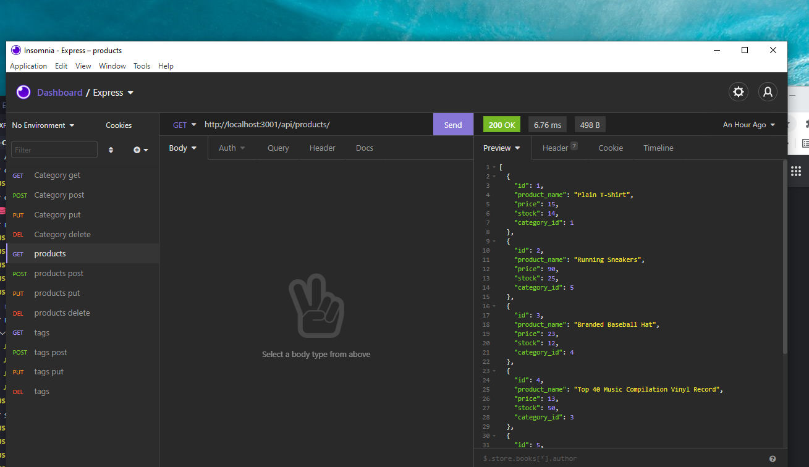

# Object-Relational Mapping (ORM): E-Commerce Back End

## Description

 > This app uses Sequelize, express.js and Node.js to generate the back-end of an E-Commerce site

 ## Screenshot:
 

## User Story

```md
AS A manager at an internet retail company
I WANT a back end for my e-commerce website that uses the latest technologies
SO THAT my company can compete with other e-commerce companies
```
## License: 
 > [](MIT)

## Table of Contents:

- [Installation](https://github.com/chuck2076/employee_cms_crs#installation)
- [Usage](https://github.com/chuck2076/employee_cms_crs#usage)
- [Video](https://github.com/chuck2076/employee_cms_crs#video)
- [Tech Stack](https://github.com/chuck2076/employee_cms_crs#tech-stack)
- [Contributors](https://github.com/chuck2076/employee_cms_crs#contributors)
- [Questions](https://github.com/chuck2076/employee_cms_crs#questions)

## Installation:
 > The user should clone the repository and open in preferred coding terminal. User will also need to install the NPM packages located in the Tech Stack for it to properly run.

## Usage:
 > Open server.js in the terminal and type node server.js at the command prompt. The user can do the following: 

```md
WHEN the user adds my database name, MySQL username, and MySQL password to an environment variable file
THEN they are able to connect to a database using Sequelize
WHEN the user enters schema and seed commands
THEN a development database is created and is seeded with test data
WHEN the user enters the command to invoke the application
THEN the server is started and the Sequelize models are synced to the MySQL database
WHEN the user opens API GET routes in Insomnia Core for categories, products, or tags
THEN the data for each of these routes is displayed in a formatted JSON
WHEN the user tests API POST, PUT, and DELETE routes in Insomnia Core
THEN they are able to successfully create, update, and delete data in my database
```
## Video: 
 > Watch a short video on how to use the E-Commerce Back End [E-Commerce Back End](https://drive.google.com/file/d/1GwiCdOKRdXnHlT51txAeGoTfXSOA0rr-/view)

## Tech Stack:

 > * Node.js 
 > * Sequelize NPM
 > * Dotenv NPM   
 > * Express.js
 > * JavaScript
 > * MySQL2

## Contributors:
 > [https://github.com/chuck2076](https://github.com/chuck2076)

## Questions:
 Chuck Stephens 
 [https://github.com/chuck2076](https://github.com/chuck2076) 

Feel free to get in touch! 
 [chuckstephens2076@gmail.com](mailto:chuckstephens2076@gmail.com)


